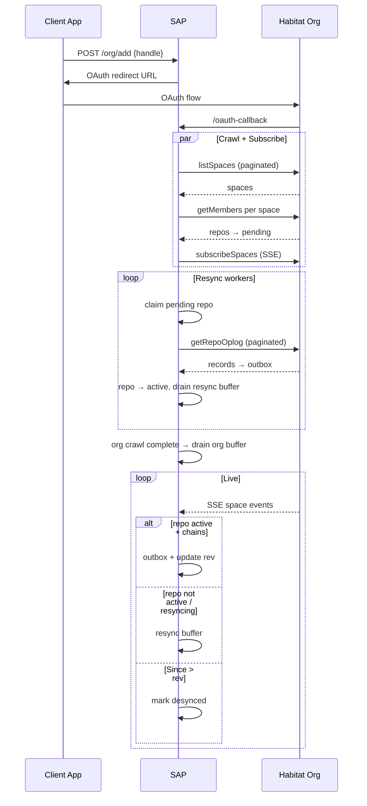

# SAP Implementation Plan

> **For agentic workers:** REQUIRED SUB-SKILL: Use superpowers:subagent-driven-development (recommended) or superpowers:executing-plans to implement this plan task-by-task. Steps use checkbox (`- [ ]`) syntax for tracking.

**Goal:** Finish `internal/sap/` — a client-side space sync service that crawls org spaces, backfills repos via oplog, streams live events, and delivers records to an outbox. Modeled after `../indigo/cmd/tap`.

**Architecture:** SAP runs in-process with a SQLite DB. Each org gets OAuth credentials, a concurrent space crawler, an SSE subscriber (`subscribeSpaces`), parallel resync workers (`getRepoOplog`), and a repo manager tracking per-(space, repo) state. Live events for non-active repos buffer to a resync table and drain after backfill.

**Tech Stack:** Go, GORM/SQLite, Habitat XRPC (`listSpaces`, `getMembers`, `getRepoOplog`, `subscribeSpaces`), OAuth2 token refresh.

---

## Current State vs Target

| Component | Status | Notes |
|-----------|--------|-------|
| Org OAuth + token refresh | Done | `org_manager.go` |
| SSE subscriber | Partial | Active-repo path works; resync buffer is a TODO |
| Crawler | Stub + bugs | Not wired; cursor lookup broken; no pagination exit |
| Repo manager | Missing | State/rev updates scattered in subscriber |
| Resyncer | Missing | No `getRepoOplog` workers |
| Resync buffer | Missing | Model + drain logic |
| Outbox | Partial | Model exists; no shared writer |
| Lifecycle wiring | Missing | Crawler/resyncer not started in `Start()` |

### Tap → SAP mapping

| Tap (`cmd/tap`) | SAP equivalent | Habitat API |
|-----------------|----------------|-------------|
| `Crawler.EnumerateNetwork` | `crawler.resumeCrawl` | `listSpaces` → `getMembers` |
| `Resyncer.doResync` (CAR fetch) | `resyncer.syncRepo` | `getRepoOplog` (paginated) |
| `FirehoseProcessor` | `subscriber` | `subscribeSpaces` (SSE) |
| `EventManager.addToResyncBuffer` | `resyncBuffer.append` | Buffer `events.Event` JSON |
| `Resyncer.drainResyncBuffer` | `resyncBuffer.drain` | Replay buffered events after backfill |
| `RepoManager` | `repoManager` (new) | `(space, did)` composite key |
| `Resyncer.claimResyncJob` | `resyncer.claimJob` | Claim `pending` / `desynced` repos |

Reference tap files while implementing:

| File | What to borrow |
|------|----------------|
| `indigo/cmd/tap/resyncer.go` | Worker pool, job claiming, drain buffer, error backoff |
| `indigo/cmd/tap/crawler.go` | Cursor pagination, batch insert with `OnConflict` |
| `indigo/cmd/tap/firehose.go` | When to buffer vs apply live vs mark desynced |
| `indigo/cmd/tap/repo_manager.go` | Repo state CRUD |
| `indigo/cmd/tap/event_manager.go` | `addToResyncBuffer` pattern |
| `indigo/cmd/tap/tap.go` | Component wiring in constructor + `Run()` |

---

## End-to-End Flow



---

### Task 1: Data model changes

**Files:**
- Modify: `internal/sap/models.go`

- [ ] **Step 1: Add `resyncing` repo state**

```go
const (
    RepoStatePending   repoState = "pending"
    RepoStateResyncing repoState = "resyncing"
    RepoStateActive    repoState = "active"
    RepoStateDesynced  repoState = "desynced"
)
```

- [ ] **Step 2: Add `resyncBuffer` table**

```go
type resyncBuffer struct {
    ID    uint `gorm:"primaryKey"`
    Space habitat_syntax.SpaceURI `gorm:"index:idx_resync_space_repo"`
    DID   syntax.DID              `gorm:"column:did;index:idx_resync_space_repo"`
    Seq   uint64
    Data  []byte // JSON-encoded events.Event
}
```

- [ ] **Step 3: Add org crawl tracking on `managedOrg`**

```go
CrawlState *string // nil | "running" | "complete"
```

- [ ] **Step 4: Fix `crawlCursor` GORM mapping** — use `Org syntax.DID` as primary key with correct column tag

- [ ] **Step 5: Add retry fields on `managedRepo`** (mirror tap): `ErrorMsg`, `RetryCount`, `RetryAfter`

- [ ] **Step 6: Register new models in `autoMigrate`**

Reference: `indigo/cmd/tap/models/models.go`

---

### Task 2: Repo manager

**Files:**
- Create: `internal/sap/repo_manager.go`
- Modify: `internal/sap/subscriber.go` (delegate to repo manager)

- [ ] **Step 1: Create `repoManager` struct**

- [ ] **Step 2: Implement `GetRepo(ctx, space, did) (*managedRepo, error)`**

- [ ] **Step 3: Implement `EnsureRepo(ctx, space, did) error`** — insert with `pending` if not exists (`OnConflict DoNothing`)

- [ ] **Step 4: Implement `ClaimForResync(ctx, state repoState) (space, did, found, err)`** — atomic claim via raw SQL:

```sql
UPDATE managed_repos SET state = 'resyncing'
WHERE (space, did) = (
  SELECT space, did FROM managed_repos
  WHERE state = ? AND (retry_after = 0 OR retry_after < ?)
  LIMIT 1
) RETURNING space, did
```

- [ ] **Step 5: Implement `SetActive(ctx, space, did, rev)`**

- [ ] **Step 6: Implement `MarkDesynced(ctx, space, did)`**

- [ ] **Step 7: Implement `ResetPartiallyResynced(ctx)`** — on startup, reset any `resyncing` → `desynced`

Reference: `indigo/cmd/tap/repo_manager.go`, `indigo/cmd/tap/resyncer.go` (`claimResyncJobOfState`)

---

### Task 3: Outbox writer

**Files:**
- Create: `internal/sap/outbox.go`

- [ ] **Step 1: Implement `writeOplogRecords(ctx, tx, space, repo, records)`** — used by resyncer

- [ ] **Step 2: Implement `writeEventOps(ctx, tx, ops)`** — used by subscriber and resync buffer drain

- [ ] **Step 3: Shared URI construction** — `ats://{org}/{space-path}/{repo}/{collection}/{rkey}`

Keep this thin — SAP's outbox is simpler than tap's `EventManager` (no WebSocket delivery, no ack cache). Client apps poll/consume the outbox separately.

---

### Task 4: Fix and wire the crawler

**Files:**
- Modify: `internal/sap/crawler.go`
- Modify: `internal/sap/sap.go`
- Modify: `internal/sap/server.go`

Current bugs to fix in `crawler.go`:
- `newCrawler(db)` missing `orgManager`
- `c.db.First(cursor, ...)` should be `c.db.First(&cursor, "org = ?", org.DID)`
- No cursor save after `listSpaces` pagination
- Infinite loop without break when pagination ends
- Crawler not started on org add or in `Start()`

- [ ] **Step 1: Fix `newCrawler(db, orgManager)` and pass through `NewSap`**

- [ ] **Step 2: Paginate `listSpaces`** — save cursor after each page; break when no cursor returned

- [ ] **Step 3: For each space, call `getMembers` and `EnsureRepo(..., pending)` for each member**

- [ ] **Step 4: Set `managedOrg.CrawlState = "running"` at start, `"complete"` when done**

- [ ] **Step 5: On OAuth callback, start crawler alongside subscriber**

```go
go s.crawler.crawlOrg(context.Background(), org)
go s.sub.addSubscription(context.Background(), org)
```

- [ ] **Step 6: On `Start()`, resume crawls for orgs where `CrawlState == "running"`**

- [ ] **Step 7: After crawl completes, call `resyncBuffer.drainOrg(ctx, org.DID)`**

Reference: `indigo/cmd/tap/crawler.go` — cursor persistence + batch repo insert pattern

---

### Task 5: Resyncer (parallel oplog sync)

**Files:**
- Create: `internal/sap/resyncer.go`

- [ ] **Step 1: Create `NewResyncer(db, orgManager, repoManager, outboxWriter, parallelism int)`**

- [ ] **Step 2: Implement `Run(ctx)`** — spawn `parallelism` workers (default 5)

- [ ] **Step 3: Implement `runWorker(ctx, id)`** — loop: claim job → sync → handle errors

- [ ] **Step 4: Implement `claimJob(ctx)`** — prioritize `pending` → `desynced` → error repos

- [ ] **Step 5: Implement `syncRepo(ctx, org, space, did)`**
  1. Load current rev from repo manager
  2. Paginate `GET /xrpc/network.habitat.space.getRepoOplog?space=...&repo=...&since=<rev>&limit=1000`
  3. For each record, write to outbox
  4. Update repo rev to page cursor after each batch
  5. When no more pages, set state `active` with final rev
  6. Call `resyncBuffer.drainRepo(ctx, space, did)`

- [ ] **Step 6: Implement `handleSyncError`** — exponential backoff 1min→1hr, set `error` state

- [ ] **Step 7: Call `resetPartiallyResynced` from `NewSap` on startup**

Reference: `indigo/cmd/tap/resyncer.go`; oplog pagination semantics in `internal/spaces/server_test.go` (`since` is exclusive, `cursor` is last record rev)

---

### Task 6: Resync buffer

**Files:**
- Create: `internal/sap/resync_buffer.go`
- Modify: `internal/sap/subscriber.go`

Replace the existing TODO in `subscriber.go` (lines ~80–84) that skips non-active repos without buffering.

- [ ] **Step 1: Implement `append(ctx, org, event)`** — insert when:
  - Org `CrawlState == "running"`, OR
  - Repo state is `pending`, `resyncing`, or `desynced`

- [ ] **Step 2: Implement `drainRepo(ctx, space, did)`** — called after repo reaches `active` via oplog sync:
  1. Load buffered events for `(space, did)` ordered by `seq ASC`
  2. For each event, verify `event.Since == currentRev` (chains correctly)
  3. If chain breaks, skip event or mark desynced
  4. Apply event: update rev, write ops to outbox
  5. Delete processed buffer rows

- [ ] **Step 3: Implement `drainOrg(ctx, orgDID)`** — called when org crawl completes

- [ ] **Step 4: Refine desync detection in subscriber** — use TID comparison: if `spaceEvent.Since > prevRepo.Rev`, mark `desynced`

Reference: `indigo/cmd/tap/firehose.go:114-116`, `indigo/cmd/tap/event_manager.go:addToResyncBuffer`, `indigo/cmd/tap/resyncer.go:drainResyncBuffer`

---

### Task 7: Lifecycle wiring

**Files:**
- Modify: `internal/sap/sap.go`
- Modify: `cmd/sap/flags.go`

- [ ] **Step 1: Extend `SapConfig` with `ResyncParallelism int` (default 5)**

- [ ] **Step 2: Construct `repoManager`, `resyncer`, `crawler` in `NewSap`**

- [ ] **Step 3: Wire `Start(ctx)`**

```go
eg.Go(func() error { return s.sub.loadSubscriptions(ctx) })
eg.Go(func() error { s.resyncer.Run(ctx); return nil })
eg.Go(func() error { s.crawler.resumeIncompleteCrawls(ctx); return nil })
```

- [ ] **Step 4: On shutdown, persist cursors via existing `closeSubscriptions()`**

Reference: `indigo/cmd/tap/tap.go` — `NewTap` + `Run()`

---

### Task 8: Tests

**Files:**
- Create/modify: `internal/sap/*_test.go`

Follow existing patterns in `subscriber_test.go` (httptest SSE server via `sync.NewServer`).

- [ ] **Step 1: `TestCrawler_DiscoverRepos`** — mock `listSpaces` + `getMembers`, verify repos inserted as `pending`

- [ ] **Step 2: `TestResyncer_SyncRepo`** — mock `getRepoOplog`, verify outbox entries + `active` state

- [ ] **Step 3: `TestResyncBuffer_AppendAndDrain`** — events during `pending` buffered, applied after sync

- [ ] **Step 4: `TestResyncBuffer_SkipsBrokenChain`** — event with wrong `Since` skipped on drain

- [ ] **Step 5: Extend `TestSubscriber_MissedEvent`** — desync detection with TID comparison

- [ ] **Step 6: `TestResyncer_ClaimJob`** — only one worker claims a repo at a time

Use the go-tdd skill for new functions.

---

## Implementation Order

1. Task 1 — Models
2. Task 2 — Repo manager
3. Task 3 — Outbox writer
4. Task 4 — Fix crawler
5. Task 5 — Resyncer
6. Task 6 — Resync buffer
7. Task 7 — Lifecycle wiring
8. Task 8 — Tests

---

## Known Gaps (out of scope)

- Outbox consumption API for client apps (poll/ack/WebSocket) — tap has `Outbox` + WebSocket; SAP only persists today
- Postgres support (`cmd/sap` is SQLite-only)
- Metrics/observability (tap has Prometheus counters)
- Periodic re-crawl to discover new spaces/members (tap re-enumerates daily)
- `RepoStateTakendown` / membership removal handling
